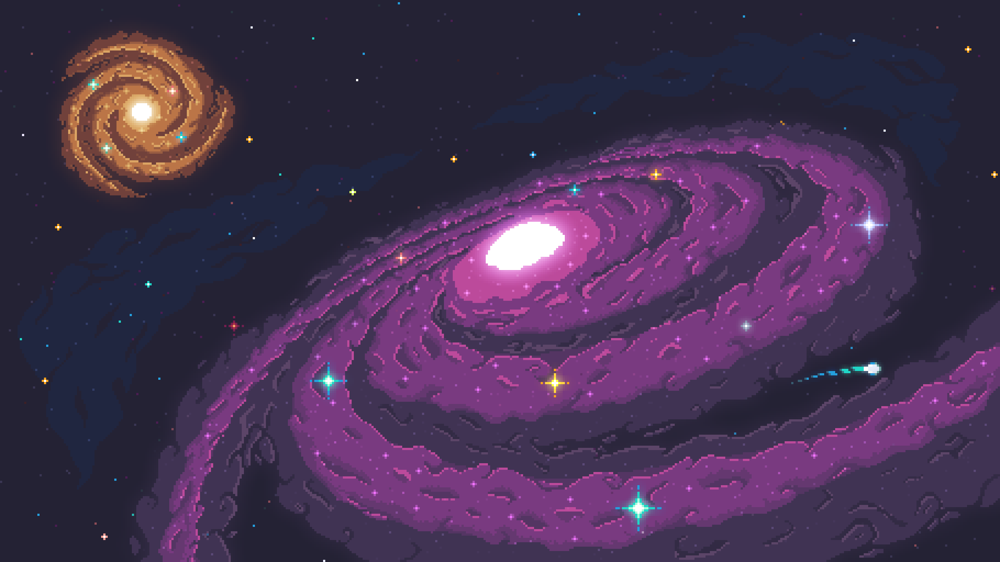

# Astral
###### ✒️ By Pedro Oliveira

## 📖T.O.C.
- [🗣️About](#🗣️about)
- [🎨Artistic declaration](#🎨artistic-declaration)
- [🎮Gameplay](#🎮gameplay)
- [🖼️Art](#🖼️art)
- [🔊Sounds](#🔊sounds)
- [💻Development](#💻development)

## 🗣️About
###### [📖t.o.c.](#📖toc)

Astral is a 2D game developed in C++ using the SDL2 library. The game is made for a University
final project, formerly T.C.C., for UFMG (Federal University of Minas Gerais).

This game is born from the desire to create a game on my own, as a project, to better understand
topics and content that I had learned during my Informations Systems course.

Here, I'll cover topics as Pathfinding algorithms, State machines and mathematics, in order to
create an INDIE game.

Along my course, I had a discipline called "Digital games development", where I learned the core
concepts needed for game development, and I had the opportunity, together with my colleagues, to
create a simple game, that looks like a proper Game engine, using C++ and SDL2. That game specifically
was called "Eter", and it's code is a start point to this project, called "Astral".

Both games will differ completely, but many of code can be reused as a starting point for later modifications.

I'd like to credit my colleagues __Eduarda Mendes, Mariana Assis, Luiza Viana__, and mainly, __***Lucas Ferreira***__, that was my
teacher during the discipline, and now my Mentor for this project.

### ❤️ Game briefing
Meet Zoe, our adventurous main character, who’s unexpectedly launched into the cosmic unknown after a surreal encounter with a black hole. 
What starts as an ordinary day in a suburban home quickly spirals into a journey across galaxies, chasing a mysterious guiding star through vibrant, 
ever-changing levels.

Astral is a space-themed platformer runner, blending exploration, fast-paced action, and clever mechanics. Players of all ages will run, jump,
shoot, dodge, and collect unique powers as Zoe navigates the void. The guiding star sometimes races ahead, challenging you to explore and discover
new paths before reuniting.

Unlock elemental abilities like:
- Ice Breath: Freeze enemies and alter surface friction.
- Wind Gust: Move objects and push Zoe backward.
- Fireball: Ricochet shots that explode on impact.
- Electric Aura: Emit electricity, swap places with electrified objects, and strategize with time and distance limits.

Astral is designed for casual gamers and indie fans, offering a cosmic adventure full of surprises, creative powers, and a dash of mystery.

##### [[🤖 Eter's github repo]](https://github.com/eduardamendes2410/Jogos-TpFinal_)

## 🎨Artistic declaration
###### [📖t.o.c.](#📖toc)
## 🎮Gameplay
###### [📖t.o.c.](#📖toc)
## 🖼️Art
###### [📖t.o.c.](#📖toc)
### Art credits
Many of the assets used in this game were created by other artists, and I would like to give them the proper credits:
- [Penzilla Design](https://penzilla.itch.io/): Main character sprites.
## 🔊Sounds
###### [📖t.o.c.](#📖toc)
## 💻Development
###### [📖t.o.c.](#📖toc)