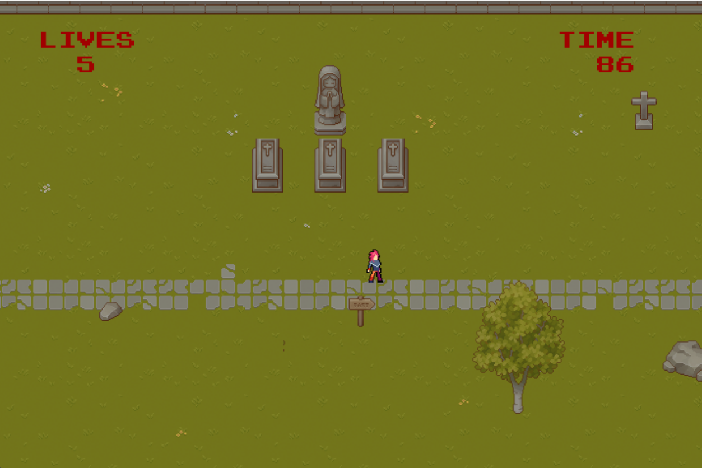
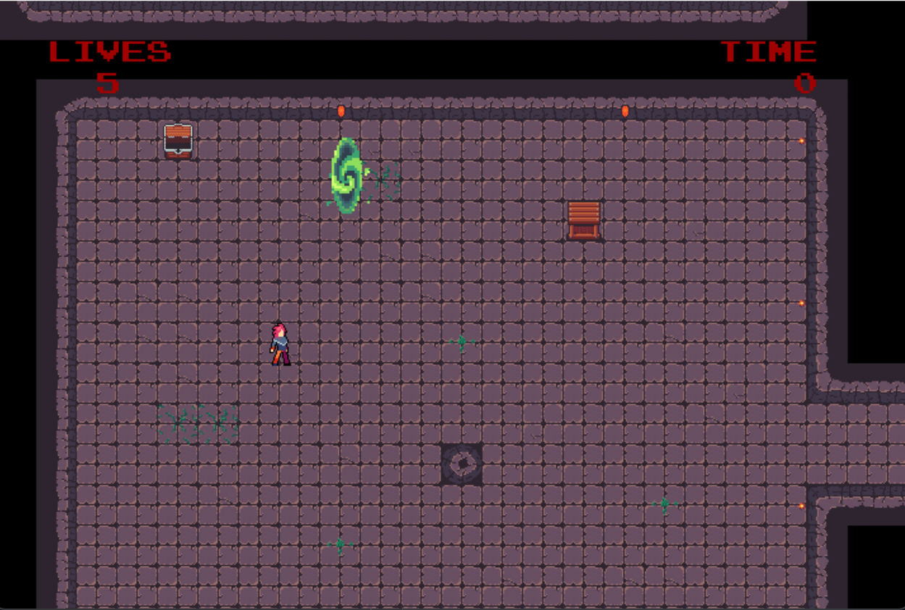
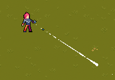
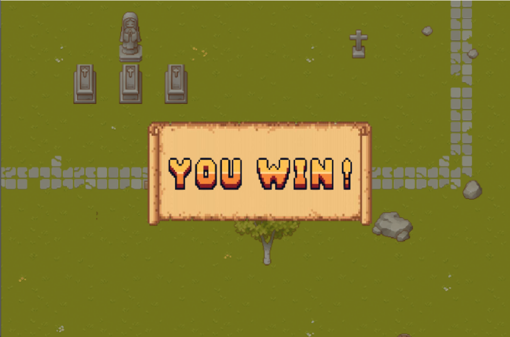

# 🎮 Éter

> *Uma jornada entre dimensões corrompidas e escolhas morais.*

---

## 📸 Screenshots

| Cena na floresta | Cena na caverna | Protagonista | Cena final  |
|------------------|-----------------|--------------|-------------|
|  |  |  |  |

---

## 🧭 Sobre o Jogo

**Éter** é um jogo top-down shooter em 2D que combina exploração, combate e narrativa interpretativa. O protagonista acorda em uma floresta desconhecida, sem saber como chegou ali. Ao explorar, ele descobre que está preso entre realidades corrompidas, e só ele pode decidir o destino desse universo. A jornada se desenrola de forma silenciosa e ambiental, guiada por pistas visuais e atmosferas mutáveis, em vez de diálogos diretos.

Inspirado por jogos como *Enter the Gungeon*, *Moonlighter* e *Hyper Light Drifter*, Éter entrega uma experiência onde o jogador explora mapas interconectados, derrota inimigos cada vez mais desafiadores, coleta recursos e desbloqueia novas habilidades e armas. As mecânicas principais incluem movimentação fluida com WASD, tiro direcional com o mouse, sistema de defesa temporária, HUD com indicadores de vida e energia, e progressão por fases. A cada ambiente superado, novas camadas da história são reveladas, acompanhadas por mudanças sutis na ambientação e na trilha sonora.

O objetivo inicial é sobreviver e encontrar respostas, mas com o tempo o foco se volta à restauração do equilíbrio entre dimensões instáveis. A jornada culmina em uma escolha moral com dois finais possíveis: voltar para sua realidade e abandonar aquele universo, ou permanecer e enfrentá-lo, mesmo sabendo que jamais poderá retornar. Não há uma tela tradicional de "derrota", mas sim consequências narrativas e mecânicas que reforçam o impacto das decisões e o peso da sobrevivência no mundo fragmentado de Éter.

---

## 🎮 Funcionalidades a Serem Testadas

- ✅ Movimentação fluida
- 🔫 Tiro direcional
- ❤️ HUD com vida e armas equipadas
- 📈 Progressão com fases: floresta → mina
- 🧠 Inimigos com padrões distintos de ataque e movimentação
- 🧩 Narrativa ambiental com final múltiplo

---

## 👥 Créditos
- Eduarda Mendes
- Luiza Viana
- Mariana Assis Ramos
- Pedro Oliveira

---

> 🎓 Desenvolvido como parte da disciplina de Desenvolvimento de Jogos Digitais – 2025 (DCC192).
